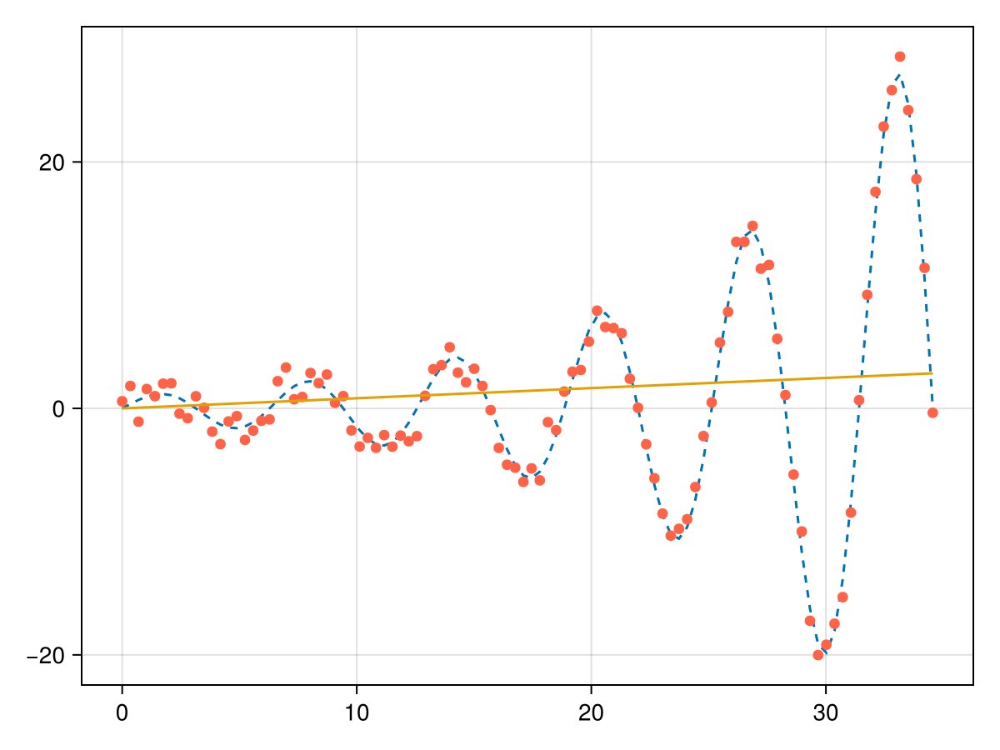

```@meta
EditURL = "main.jl"
```

functions required

````@example main
using CairoMakie
````

selecting the test function to be f(x) = exp(x) sin(x)

````@example main
function test_fun(t)
    return exp(0.1t)*sin(t)
end
````

the domain of function be [0,100]

````@example main
t = range(0,11*pi,length=100)
````

for training add noise epsilon ~ N(0,1) to output

````@example main
y =  test_fun.(t)

y_with_noise = y +  randn(length(t))

lines(t,y,linestyle=:dash)
scatter!(t,y_with_noise , color= :tomato)
current_figure()
````

Linear Regression
Calculate coefficient

````@example main
"""
   linear_coeff
   parameters : x,y
   output : array
"""
function linear_coeff(x,y)
    return inv(x'*x)*x'*y
end
````

calculate and plot

````@example main
app_y = linear_coeff(t,y_with_noise)*t
lines!(t,app_y)
save("plot1.png", current_figure())  # save it
````


question no 2

````@example main
using Lux , Random

model = Dense(10 => 5)
rng = Random.default_rng()
Random.seed!(rng,0)
````

---

*This page was generated using [Literate.jl](https://github.com/fredrikekre/Literate.jl).*

